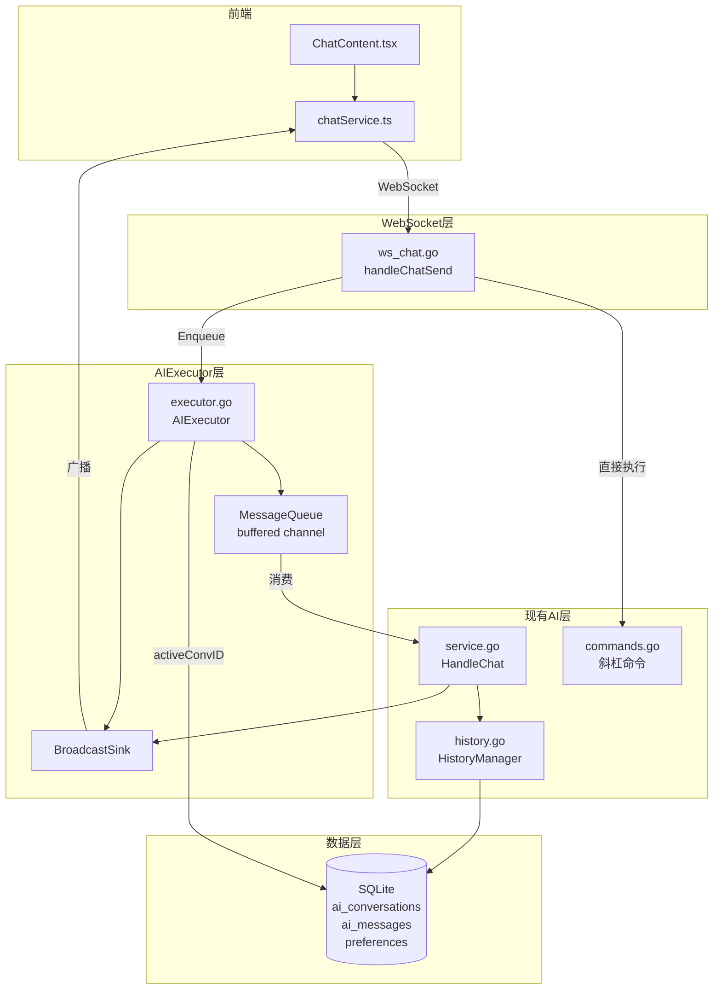
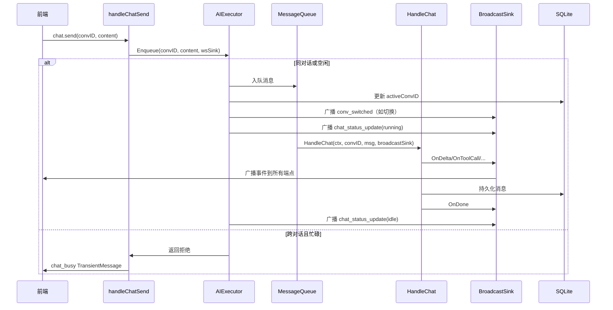

# 技术设计文档：AI 后台独立执行器

## 概述

本设计将 AI 聊天系统从"前端驱动、直连执行"模式重构为"后台独立执行"模式。核心变更是在 `Service.HandleChat` 之上引入 `AIExecutor` 层，负责消息队列、广播分发和活跃对话管理。`HandleChat` 本身保持不变，仅由 AIExecutor 的消费 goroutine 调用。

当前架构中，`handleChatSend` 直接创建 `wsSink` 并调用 `HandleChat`，AI 执行与 WebSocket 连接强耦合。重构后，`handleChatSend` 仅负责将消息入队到 AIExecutor，由 AIExecutor 通过 `BroadcastSink` 将事件广播到所有已连接端点。前端断开不影响 AI 执行，重连后从数据库恢复状态并接收实时事件。

### 关键设计决策

| 决策 | 选择 | 理由 |
|------|------|------|
| 消息队列实现 | Go buffered channel + 单消费 goroutine | 简单可靠，无需外部依赖，单消费者天然保证顺序执行 |
| 广播机制 | BroadcastSink 实现 ChatSink 接口 | 复用现有接口，对 HandleChat 零侵入 |
| 活跃对话存储 | preferences 表 | 复用现有基础设施，重启后可恢复 |
| 忙碌拒绝策略 | 同对话排队，跨对话拒绝 | 同对话消息有上下文连续性需排队；跨对话切换需显式操作 |
| 查看 vs 激活 | 侧边栏点击=查看，发送消息=激活 | 避免误切换活跃对话，保持 AI 执行连续性 |
| 停止机制 | `/stop` 命令替代停止按钮 | 统一命令入口，适配多端（UI、飞书、Telegram） |

## 架构

### 系统架构图



### 消息流转时序图



## 组件与接口

### 1. AIExecutor（新增：`webos-backend/internal/ai/executor.go`）

AIExecutor 是本次重构的核心组件，负责消息队列管理、BroadcastSink 管理和活跃对话调度。

```go
// EnqueueMsg 表示入队的用户消息
type EnqueueMsg struct {
    ConvID  string
    Content string
}

// EnqueueResult 表示入队操作的结果
type EnqueueResult struct {
    Accepted bool
    // 拒绝时的信息
    BusyConvID    string
    BusyConvTitle string
}

// ExecutorStatus 表示执行器当前状态
type ExecutorStatus struct {
    State         string `json:"state"`         // "idle" 或 "running"
    ConvID        string `json:"convId"`        // 当前执行的对话 ID
    ConvTitle     string `json:"convTitle"`     // 当前执行的对话标题
    QueueSize     int    `json:"queueSize"`     // 队列中等待的消息数
}

// AIExecutor 管理消息队列和广播
type AIExecutor struct {
    service       *Service
    queue         chan EnqueueMsg
    broadcastSink *BroadcastSink
    
    mu            sync.Mutex
    activeConvID  string          // 内存缓存，启动时从 DB 加载
    runningConvID string          // 当前正在执行的对话 ID
    cancelFn      context.CancelFunc // 当前执行的取消函数
}

// NewAIExecutor 创建并启动执行器
func NewAIExecutor(service *Service) *AIExecutor

// Start 启动消费 goroutine
func (e *AIExecutor) Start()

// Enqueue 将消息入队，返回是否接受
func (e *AIExecutor) Enqueue(convID, content string) EnqueueResult

// Stop 取消当前正在执行的任务
func (e *AIExecutor) Stop()

// Status 返回当前执行状态
func (e *AIExecutor) Status() ExecutorStatus

// RegisterSink 注册一个子 Sink（端点连接时调用）
func (e *AIExecutor) RegisterSink(id string, sink ChatSink)

// UnregisterSink 移除一个子 Sink（端点断开时调用）
func (e *AIExecutor) UnregisterSink(id string)
```

**入队逻辑：**
- 如果当前空闲（`runningConvID == ""`）：接受消息，更新 `activeConvID`，入队
- 如果当前忙碌且 `convID == runningConvID`：接受消息，入队排队
- 如果当前忙碌且 `convID != runningConvID`：拒绝，返回 `BusyConvID` 和 `BusyConvTitle`

**消费 goroutine 逻辑：**
```
for msg := range queue:
    1. 设置 runningConvID = msg.ConvID
    2. 如果 activeConvID != msg.ConvID，更新 activeConvID 并广播 conv_switched
    3. 广播 chat_status_update(running)
    4. ctx, cancel = context.WithTimeout(30min)
    5. service.HandleChat(ctx, msg.ConvID, msg.Content, broadcastSink)
    6. 设置 runningConvID = ""
    7. 广播 chat_status_update(idle 或 running，取决于队列是否还有消息)
```

### 2. BroadcastSink（新增：`webos-backend/internal/ai/executor.go`）

```go
// BroadcastSink 实现 ChatSink 接口，将事件广播到所有已注册的子 Sink
type BroadcastSink struct {
    mu    sync.RWMutex
    sinks map[string]ChatSink // key: 端点 ID
}

func NewBroadcastSink() *BroadcastSink

// Add 注册子 Sink
func (b *BroadcastSink) Add(id string, sink ChatSink)

// Remove 移除子 Sink
func (b *BroadcastSink) Remove(id string)

// ChatSink 接口实现：遍历所有子 Sink 转发事件
// 如果某个子 Sink 转发失败，移除该 Sink 并继续
func (b *BroadcastSink) OnDelta(convID, text string)
func (b *BroadcastSink) OnThinking(convID, text string)
func (b *BroadcastSink) OnToolCallPending(convID string, pending ToolCallPending)
func (b *BroadcastSink) OnToolCall(convID string, call ToolCall)
func (b *BroadcastSink) OnToolResult(convID string, result ToolResult)
func (b *BroadcastSink) OnShellOutput(convID, toolCallID string, output ShellOutput)
func (b *BroadcastSink) OnUIAction(convID string, action UIAction)
func (b *BroadcastSink) OnDone(convID, fullText string, usage TokenUsage)
func (b *BroadcastSink) OnError(convID string, err error)
```

**广播实现模式（每个方法相同）：**
```go
func (b *BroadcastSink) OnDelta(convID, text string) {
    b.mu.RLock()
    sinks := make(map[string]ChatSink, len(b.sinks))
    for k, v := range b.sinks {
        sinks[k] = v
    }
    b.mu.RUnlock()
    
    for id, sink := range sinks {
        func() {
            defer func() {
                if r := recover(); r != nil {
                    b.Remove(id)
                }
            }()
            sink.OnDelta(convID, text)
        }()
    }
}
```

### 3. handleChatSend 改造（修改：`webos-backend/internal/handler/ws_chat.go`）

```go
func handleChatSend(c *WSConn, raw json.RawMessage) {
    var p struct {
        ConversationID string `json:"conversationId"`
        MessageContent string `json:"messageContent"`
    }
    json.Unmarshal(raw, &p)

    convID, content := p.ConversationID, p.MessageContent

    // 斜杠命令继续直接执行，不经过 AIExecutor
    if cmdName, cmdArgs, isCmd := ai.ParseCommand(content); isCmd {
        go func() {
            result := aiService.ExecuteCommand(convID, cmdName, cmdArgs)
            aiService.HandleCommandResult(convID, result)
            c.WriteJSON(wsServerMsg{
                Type: "chat_command_result",
                Data: map[string]interface{}{...},
            })
        }()
        return
    }

    // 普通消息通过 AIExecutor 入队
    result := executor.Enqueue(convID, content)
    if !result.Accepted {
        // 发送 chat_busy TransientMessage
        c.WriteJSON(wsServerMsg{
            Type: "chat_busy",
            Data: map[string]interface{}{
                "rejectedConvId":   convID,
                "busyConvTitle":    result.BusyConvTitle,
                "hint":            "AI 正在执行「" + result.BusyConvTitle + "」，发送 /stop 可停止当前任务",
            },
        })
    }
}
```

### 4. WebSocket 连接生命周期改造（修改：`webos-backend/internal/handler/ws.go`）

在 `HandleUnifiedWS` 中增加 AIExecutor Sink 注册/注销：

```go
// 连接建立后，注册 wsSink 到 AIExecutor
sink := &wsSink{writeJSON: wc.WriteJSON}
executor.RegisterSink(connID, sink)

// 立即发送当前执行状态
status := executor.Status()
wc.WriteJSON(wsServerMsg{Type: "chat_status_update", Data: status})

// 清理时注销
defer func() {
    executor.UnregisterSink(connID)
    // ... 其他清理
}()
```

### 5. 对话管理斜杠命令（修改：`webos-backend/internal/ai/commands.go`）

新增三个命令注册到现有命令系统：

```go
// /conv list - 列出所有对话
{Name: "conv list", Desc: "列出所有对话", Category: "对话"}

// /conv switch <id> - 切换活跃对话
{Name: "conv switch", Desc: "切换活跃对话", Category: "对话", Args: "<id>"}

// /conv new - 创建新对话
{Name: "conv new", Desc: "创建新对话并激活", Category: "对话"}
```

命令执行逻辑需要访问 AIExecutor，因此在 Service 中增加对 AIExecutor 的引用，或将命令执行委托给 AIExecutor。

### 6. 前端 chatService 扩展（修改：`webos-frontend/src/apps/ai-chat/chatService.ts`）

新增三种消息类型处理和对应的 ChatEvent 类型：

```typescript
// 新增 ChatEvent 类型
export interface ChatEvent {
  type: '...' | 'chat_busy' | 'status_update' | 'conv_switched'
  // chat_busy
  busyInfo?: { rejectedConvId: string; busyConvTitle: string; hint: string }
  // status_update
  statusUpdate?: { state: 'idle' | 'running'; convId: string; convTitle: string; queueSize: number }
  // conv_switched
  convSwitched?: { convId: string; convTitle: string }
}

// 新增 WS 消息处理
case 'chat_busy':
  emit({ type: 'chat_busy', busyInfo: msg.data })
  return true
case 'chat_status_update':
  emit({ type: 'status_update', statusUpdate: msg.data })
  return true
case 'conv_switched':
  emit({ type: 'conv_switched', convSwitched: msg.data })
  return true
```

### 7. 前端 UI 改造（修改：`webos-frontend/src/apps/ai-chat/ChatContent.tsx`）

**新增状态：**
```typescript
const [executorStatus, setExecutorStatus] = useState<ExecutorStatus>({ state: 'idle', convId: '', convTitle: '', queueSize: 0 })
const [activeConvId, setActiveConvId] = useState('')  // 全局活跃对话
const [viewingConvId, setViewingConvId] = useState('') // 当前查看的对话
```

**状态栏组件：**
- 空闲时：显示"AI 空闲"
- 执行中：显示"AI 正在执行「{convTitle}」"及实时输出摘要

**UI 变更：**
- 移除停止按钮，始终显示发送按钮
- 侧边栏点击仅切换 `viewingConvId`，加载历史消息
- 发送消息时以 `viewingConvId` 作为目标对话发送
- 收到 `chat_busy` 时在聊天区域显示临时系统提示
- 收到 `conv_switched` 时更新侧边栏高亮

## 数据模型

### 现有表（不变）

**ai_conversations**
| 字段 | 类型 | 说明 |
|------|------|------|
| id | TEXT PK | 对话 ID |
| title | TEXT | 对话标题 |
| created_at | INTEGER | 创建时间戳 |
| updated_at | INTEGER | 更新时间戳 |

**ai_messages**
| 字段 | 类型 | 说明 |
|------|------|------|
| id | INTEGER PK | 自增 ID |
| conversation_id | TEXT | 所属对话 |
| role | TEXT | user/assistant/tool |
| content | TEXT | 消息内容 |
| tool_calls | TEXT | JSON 格式工具调用 |
| tool_call_id | TEXT | 工具调用 ID |
| token_usage | TEXT | Token 使用统计 |
| thinking | TEXT | 思考过程 |
| created_at | INTEGER | 创建时间戳 |

### 新增数据（preferences 表）

**preferences 表新增键值：**

| key | value 格式 | 说明 |
|-----|-----------|------|
| `active_conv_id` | JSON 字符串（如 `"\"conv_abc123\""`) | 全局活跃对话 ID，通过 `database.SetPreference` / `database.GetPreference` 读写 |

使用现有的 `database.SetPreference(key, value)` 和 `database.GetPreference(key)` 方法，无需新增数据库表或迁移。

### WebSocket 消息协议（新增）

**chat_busy（服务端 → 客户端）**
```json
{
  "type": "chat_busy",
  "data": {
    "rejectedConvId": "conv_123",
    "busyConvTitle": "代码重构讨论",
    "hint": "AI 正在执行「代码重构讨论」，发送 /stop 可停止当前任务"
  }
}
```

**chat_status_update（服务端 → 客户端）**
```json
{
  "type": "chat_status_update",
  "data": {
    "state": "running",
    "convId": "conv_123",
    "convTitle": "代码重构讨论",
    "queueSize": 1
  }
}
```

**conv_switched（服务端 → 客户端）**
```json
{
  "type": "conv_switched",
  "data": {
    "convId": "conv_456",
    "convTitle": "新功能设计"
  }
}
```

## 正确性属性

*属性（Property）是在系统所有合法执行中都应成立的特征或行为——本质上是对系统应做什么的形式化陈述。属性是人类可读规格说明与机器可验证正确性保证之间的桥梁。*

### Property 1: 消息队列 FIFO 顺序

*For any* 消息序列 [m1, m2, ..., mn]（均属于同一对话），按顺序入队后，消费 goroutine 的执行顺序应与入队顺序完全一致。

**Validates: Requirements 1.2**

### Property 2: 互斥执行

*For any* 时刻，AIExecutor 中正在执行的消息数量应 ≤ 1。即 `runningConvID` 在消费开始时设置，在消费结束时清除，期间不会有第二条消息开始执行。

**Validates: Requirements 1.3**

### Property 3: Sink 注册/注销往返

*For any* ChatSink 实例，通过 `Add(id, sink)` 注册后，该 sink 应收到后续所有广播事件；通过 `Remove(id)` 注销后，该 sink 不应再收到任何广播事件。

**Validates: Requirements 2.2, 2.3**

### Property 4: 广播投递完整性

*For any* 已注册的 sink 集合和任意 ChatSink 事件，BroadcastSink 应将该事件转发到集合中的每一个 sink。

**Validates: Requirements 2.4**

### Property 5: 失败 Sink 隔离

*For any* 已注册的 sink 集合，如果其中一个 sink 在转发时 panic，BroadcastSink 应移除该失败 sink 并继续向其余 sink 正常转发事件。

**Validates: Requirements 2.6**

### Property 6: ActiveConvID 持久化往返

*For any* 消息入队操作（convID, content），入队成功后，从数据库 preferences 表读取 `active_conv_id` 应返回该 convID。

**Validates: Requirements 3.1, 3.2, 6.2**

### Property 7: 入队接受/拒绝规则

*For any* 正在执行对话 A 的 AIExecutor 和任意入队请求（convID=B），当 A == B 时请求应被接受（入队排队），当 A != B 时请求应被拒绝（返回 BusyConvID=A）。当 AIExecutor 空闲时，任意对话的入队请求都应被接受。

**Validates: Requirements 4.1, 4.2**

### Property 8: TransientMessage 不持久化

*For any* 被拒绝的入队请求，数据库 ai_messages 表中不应出现对应的 `chat_busy` 消息记录。

**Validates: Requirements 4.3**

### Property 9: 状态变更广播完整性

*For any* AIExecutor 状态变更（idle→running 或 running→idle），应通过 BroadcastSink 广播 `chat_status_update` 消息，且消息包含 state、convId、convTitle、queueSize 四个字段。当 activeConvID 发生变更时，应额外广播 `conv_switched` 消息。

**Validates: Requirements 3.4, 5.1, 5.2**

### Property 10: 对话列表完整性

*For any* 数据库中存在的对话集合，`/conv list` 命令返回的列表应包含所有对话的 ID 和标题，且不遗漏。

**Validates: Requirements 6.1**

## 错误处理

### 后端错误处理

| 场景 | 处理方式 |
|------|---------|
| Enqueue 时队列已满 | 返回拒绝结果，前端显示系统繁忙提示（channel buffer 设为合理大小如 64，实际场景不太可能满） |
| HandleChat 执行 panic | 消费 goroutine 中 defer recover，记录日志，广播 OnError，重置 runningConvID 为空，继续消费下一条 |
| HandleChat 执行超时 | context.WithTimeout(30min) 超时后自动取消，广播 OnError，状态恢复空闲 |
| BroadcastSink 子 Sink 写入失败 | 移除失败的 sink，继续向其余 sink 广播，不影响 AI 执行 |
| 数据库写入 activeConvID 失败 | 记录日志，内存中的 activeConvID 仍然有效，不阻塞消息执行 |
| `/conv switch` 指定不存在的对话 ID | 返回 CommandResult{IsError: true, Text: "对话不存在: <id>"} |
| `/stop` 时无任务执行 | 返回 CommandResult{Text: "当前没有正在执行的任务"} |

### 前端错误处理

| 场景 | 处理方式 |
|------|---------|
| 收到 `chat_busy` | 在聊天区域显示临时系统提示（不持久化），包含 `/stop` 提示 |
| WebSocket 断开 | 现有重连机制不变，重连后通过 `chat_status_update` 恢复状态 |
| 收到未知消息类型 | 忽略（现有 switch default 行为） |

## 测试策略

### 双重测试方法

本功能采用单元测试 + 属性测试的双重策略：

- **单元测试**：验证具体示例、边界情况和错误条件
- **属性测试**：验证跨所有输入的通用属性

两者互补，单元测试捕获具体 bug，属性测试验证通用正确性。

### 属性测试配置

- 使用 Go 标准库 `testing/quick` 或 `github.com/leanovate/gopter` 作为属性测试库
- 每个属性测试最少运行 100 次迭代
- 每个属性测试必须通过注释引用设计文档中的属性编号
- 标签格式：**Feature: ai-background-executor, Property {number}: {property_text}**
- 每个正确性属性由一个属性测试实现

### 测试文件结构

```
webos-backend/internal/ai/
  executor_test.go       # AIExecutor 单元测试 + 属性测试
  broadcast_sink_test.go # BroadcastSink 单元测试 + 属性测试
```

### 单元测试覆盖

| 测试场景 | 文件 | 类型 |
|---------|------|------|
| AIExecutor 初始化 | executor_test.go | 示例 |
| 空闲时入队成功 | executor_test.go | 示例 |
| 忙碌时同对话入队排队 | executor_test.go | 示例 |
| 忙碌时跨对话入队拒绝 | executor_test.go | 示例 |
| Stop 取消当前任务 | executor_test.go | 示例 |
| BroadcastSink 空列表不 panic | broadcast_sink_test.go | 边界 |
| BroadcastSink 子 Sink panic 隔离 | broadcast_sink_test.go | 边界 |
| /conv list 返回所有对话 | executor_test.go | 示例 |
| /conv switch 不存在的 ID | executor_test.go | 边界 |
| /conv new 创建并激活 | executor_test.go | 示例 |

### 属性测试覆盖

| 属性 | 测试标签 | 生成器 |
|------|---------|--------|
| Property 1: FIFO 顺序 | Feature: ai-background-executor, Property 1: 消息队列 FIFO 顺序 | 随机消息序列（随机字符串内容） |
| Property 2: 互斥执行 | Feature: ai-background-executor, Property 2: 互斥执行 | 随机并发入队操作 |
| Property 3: Sink 往返 | Feature: ai-background-executor, Property 3: Sink 注册/注销往返 | 随机 sink ID 序列 + 随机 add/remove 操作 |
| Property 4: 广播完整性 | Feature: ai-background-executor, Property 4: 广播投递完整性 | 随机 sink 集合 + 随机事件 |
| Property 5: 失败隔离 | Feature: ai-background-executor, Property 5: 失败 Sink 隔离 | 随机 sink 集合（含一个 panic sink） |
| Property 6: ActiveConvID 往返 | Feature: ai-background-executor, Property 6: ActiveConvID 持久化往返 | 随机对话 ID |
| Property 7: 接受/拒绝规则 | Feature: ai-background-executor, Property 7: 入队接受/拒绝规则 | 随机 (runningConvID, enqueueConvID) 对 |
| Property 8: 不持久化 | Feature: ai-background-executor, Property 8: TransientMessage 不持久化 | 随机拒绝场景 |
| Property 9: 状态广播 | Feature: ai-background-executor, Property 9: 状态变更广播完整性 | 随机状态转换序列 |
| Property 10: 对话列表 | Feature: ai-background-executor, Property 10: 对话列表完整性 | 随机对话集合 |
