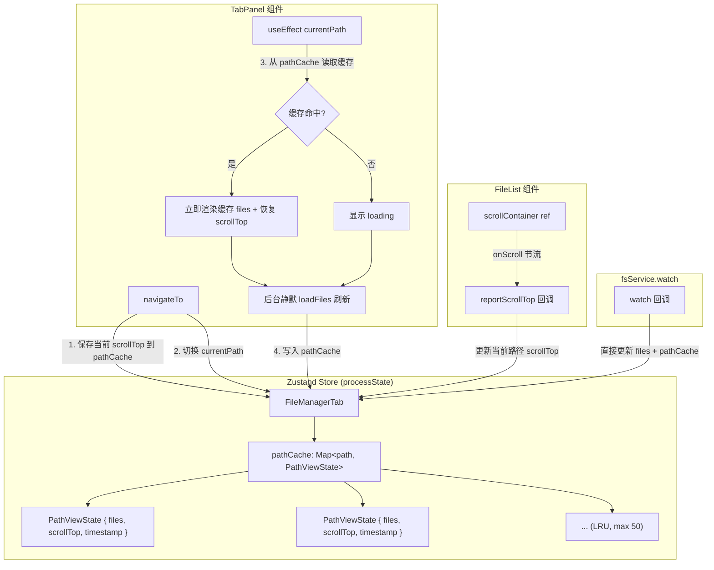
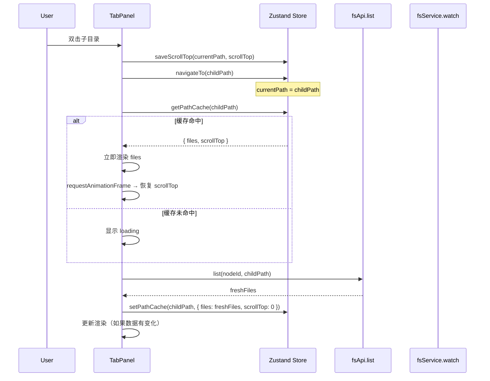
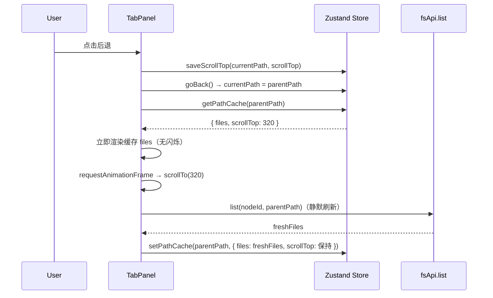

# 设计文档：文件管理器路径级视图状态管理 (fm-path-view-state)

## 概述

当前文件管理器在目录导航时存在两个体验问题：返回父目录时滚动位置丢失，以及进入子目录时会闪现父目录内容。根因在于 `files` state 是跨路径共享的单一变量，切换路径时旧数据先渲染再被异步加载的新数据替换；同时滚动位置没有与路径绑定的持久化机制。

本方案采用"路径级视图状态下沉到 store"的架构，为每个 tab 引入以路径为 key 的视图状态缓存（`PathViewState`），包含 `files` 和 `scrollTop`。导航时优先从缓存取数据瞬间渲染，再后台静默刷新。类似浏览器的 bfcache 机制。

核心改动集中在三个层面：类型扩展（`FileManagerTab` 增加 `pathCache`）、store 逻辑（LRU 缓存管理）、组件层（`TabPanel` 和 `FileList` 的缓存读写与滚动恢复）。

## 架构



## 时序图

### 导航进入子目录



### 返回父目录



## 组件与接口

### 数据类型扩展

```typescript
/** 单个路径的视图状态缓存 */
interface PathViewState {
  files: FileInfo[]
  scrollTop: number
  timestamp: number  // 用于 LRU 淘汰
}

/** 扩展后的 FileManagerTab */
interface FileManagerTab {
  id: string
  currentPath: string
  history: string[]
  historyIndex: number
  files: FileInfo[]           // 保留，兼容现有逻辑
  selectedFiles: string[]
  activeNodeId: string
  title: string
  pathCache: Record<string, PathViewState>  // 新增：路径级缓存
}
```

### LRU 缓存管理

```typescript
const PATH_CACHE_MAX = 50

/**
 * 写入路径缓存，超出上限时淘汰最旧条目
 * 纯函数，返回新的 pathCache 对象
 */
function setPathCache(
  cache: Record<string, PathViewState>,
  path: string,
  state: Omit<PathViewState, 'timestamp'>
): Record<string, PathViewState> {
  const newCache = { ...cache }
  newCache[path] = { ...state, timestamp: Date.now() }

  const keys = Object.keys(newCache)
  if (keys.length > PATH_CACHE_MAX) {
    // 找到 timestamp 最小的条目淘汰
    let oldestKey = keys[0]
    let oldestTime = newCache[oldestKey].timestamp
    for (const k of keys) {
      if (newCache[k].timestamp < oldestTime) {
        oldestKey = k
        oldestTime = newCache[k].timestamp
      }
    }
    delete newCache[oldestKey]
  }

  return newCache
}

/**
 * 读取路径缓存，命中时更新 timestamp（LRU touch）
 * 返回 [缓存数据 | null, 更新后的 cache]
 */
function getPathCache(
  cache: Record<string, PathViewState>,
  path: string
): [PathViewState | null, Record<string, PathViewState>] {
  const entry = cache[path]
  if (!entry) return [null, cache]
  // Touch: 更新 timestamp
  const updated = { ...cache, [path]: { ...entry, timestamp: Date.now() } }
  return [entry, updated]
}
```

### Store 层扩展

```typescript
// store.ts 中 addFmTab 的 newTab 初始化增加 pathCache
const newTab: FileManagerTab = {
  id: `fmtab-${Date.now()}`,
  currentPath: '~',
  history: ['~'],
  historyIndex: 0,
  files: [],
  selectedFiles: [],
  activeNodeId: 'local_1',
  title: '~',
  pathCache: {},  // 新增
}

// updateFmTabState 无需改动，已支持 Partial<FileManagerTab>
```

### TabPanel 组件改动

```typescript
// TabPanel 内部关键改动点

// 1. 从 tab 读取 pathCache
const pathCache = tab?.pathCache ?? {}

// 2. navigateTo 前保存当前滚动位置
const navigateTo = useCallback((path: string) => {
  // 保存当前路径的 scrollTop
  const scrollEl = dropZoneRef.current
  if (scrollEl) {
    const currentScrollTop = scrollEl.scrollTop
    const newCache = setPathCache(pathCache, currentPath, {
      files,
      scrollTop: currentScrollTop,
    })
    updateFmTabState(windowId, tabIndex, { pathCache: newCache })
  }

  // 原有导航逻辑
  setSearchKeyword("")
  const newHistory = history.slice(0, historyIndex + 1)
  newHistory.push(path)
  const title = path.split('/').filter(Boolean).pop() || '/'
  updateFmTabState(windowId, tabIndex, {
    currentPath: path, history: newHistory,
    historyIndex: newHistory.length - 1, title,
  })
}, [/* deps */])

// 3. currentPath 变化时：先从缓存恢复，再后台刷新
const pendingScrollRef = useRef<number | null>(null)

useEffect(() => {
  const [cached, touchedCache] = getPathCache(pathCache, currentPath)

  if (cached) {
    // 缓存命中：立即渲染缓存数据
    setFiles(cached.files)
    filesRef.current = cached.files
    pendingScrollRef.current = cached.scrollTop
    // 更新 LRU timestamp
    updateFmTabState(windowId, tabIndex, { pathCache: touchedCache })
    // 后台静默刷新（不显示 loading）
    loadFilesSilent(currentPath)
  } else {
    // 缓存未命中：走原有 loading 流程
    setFiles([])
    pendingScrollRef.current = null
    loadFiles(currentPath)
  }
}, [currentPath])

// 4. 渲染后恢复滚动位置
useEffect(() => {
  if (pendingScrollRef.current !== null && files.length > 0) {
    const scrollEl = dropZoneRef.current
    if (scrollEl) {
      requestAnimationFrame(() => {
        scrollEl.scrollTop = pendingScrollRef.current!
        pendingScrollRef.current = null
      })
    }
  }
}, [files])

// 5. loadFiles 拆分为两个版本
const loadFiles = useCallback(async (path = currentPath) => {
  try {
    if (filesRef.current.length === 0) setLoading(true)
    const rawList = await fsApi.list(activeNodeId, path)
    const fileList = rawList.map((f: FileInfo) => ({ ...f, nodeId: activeNodeId }))
    setFiles(fileList)
    filesRef.current = fileList
    // 写入缓存
    const scrollTop = dropZoneRef.current?.scrollTop ?? 0
    const newCache = setPathCache(pathCache, path, { files: fileList, scrollTop })
    updateFmTabState(windowId, tabIndex, { pathCache: newCache })
  } catch (error) {
    console.error("加载文件列表失败:", error)
    setFiles([])
    filesRef.current = []
  } finally {
    setLoading(false)
  }
}, [currentPath, activeNodeId, pathCache])

// 静默刷新版本（不触发 loading 状态）
const loadFilesSilent = useCallback(async (path: string) => {
  try {
    const rawList = await fsApi.list(activeNodeId, path)
    const fileList = rawList.map((f: FileInfo) => ({ ...f, nodeId: activeNodeId }))
    // 仅当路径未变时才更新（防止竞态）
    if (path === currentPath) {
      setFiles(fileList)
      filesRef.current = fileList
      const scrollTop = dropZoneRef.current?.scrollTop ?? 0
      const newCache = setPathCache(pathCache, path, { files: fileList, scrollTop })
      updateFmTabState(windowId, tabIndex, { pathCache: newCache })
    }
  } catch (error) {
    console.error("静默刷新失败:", error)
  }
}, [currentPath, activeNodeId, pathCache])
```

### FileList 组件改动

```typescript
// FileList props 新增
interface FileListProps {
  // ... 现有 props
  onScrollChange?: (scrollTop: number) => void  // 新增
}

// FileList 内部：节流上报滚动位置
function FileList({ /* ... */, onScrollChange }: FileListProps) {
  const scrollThrottleRef = useRef<ReturnType<typeof setTimeout> | null>(null)

  const handleScroll = useCallback((e: React.UIEvent<HTMLDivElement>) => {
    if (!onScrollChange) return
    if (scrollThrottleRef.current) return
    scrollThrottleRef.current = setTimeout(() => {
      scrollThrottleRef.current = null
      onScrollChange((e.target as HTMLElement).scrollTop)
    }, 150)
  }, [onScrollChange])

  return (
    <div
      ref={dropZoneRef}
      className="flex-1 overflow-auto p-3 ..."
      onScroll={handleScroll}  // 新增
      // ... 其余不变
    >
      {/* ... */}
    </div>
  )
}
```

### goBack / goForward 改动

```typescript
const goBack = useCallback(() => {
  if (historyIndex <= 0) return
  // 保存当前滚动位置
  const scrollEl = dropZoneRef.current
  if (scrollEl) {
    const newCache = setPathCache(pathCache, currentPath, {
      files,
      scrollTop: scrollEl.scrollTop,
    })
    updateFmTabState(windowId, tabIndex, { pathCache: newCache })
  }
  // 原有逻辑
  const newIndex = historyIndex - 1
  const path = history[newIndex]
  const title = path.split('/').filter(Boolean).pop() || '/'
  updateFmTabState(windowId, tabIndex, {
    currentPath: path, historyIndex: newIndex, selectedFiles: [], title,
  })
}, [/* deps */])

// goForward 同理
```

## 数据模型

### PathViewState

| 字段 | 类型 | 说明 |
|------|------|------|
| `files` | `FileInfo[]` | 该路径下的文件列表快照 |
| `scrollTop` | `number` | 滚动容器的 scrollTop 值 |
| `timestamp` | `number` | 最后访问时间戳，用于 LRU 淘汰 |

### 验证规则

- `files` 可以为空数组（空目录）
- `scrollTop` >= 0
- `timestamp` 为有效的 `Date.now()` 值
- `pathCache` 的 key 数量 <= 50（PATH_CACHE_MAX）


## 算法伪代码与形式化规约

### 算法 1：导航切换路径

```pascal
ALGORITHM navigateToPath(targetPath)
INPUT: targetPath: string — 目标路径
PRECONDITION: targetPath ≠ "" ∧ targetPath ≠ currentPath
POSTCONDITION: currentPath = targetPath ∧ 旧路径的 scrollTop 已保存

BEGIN
  // Step 1: 保存当前视图状态
  scrollEl ← dropZoneRef.current
  IF scrollEl ≠ NULL THEN
    currentScrollTop ← scrollEl.scrollTop
    pathCache ← setPathCache(pathCache, currentPath, {
      files: currentFiles,
      scrollTop: currentScrollTop
    })
  END IF

  // Step 2: 更新导航历史
  newHistory ← history[0..historyIndex] ++ [targetPath]
  historyIndex ← length(newHistory) - 1
  currentPath ← targetPath

  // Step 3: 尝试从缓存恢复
  [cached, touchedCache] ← getPathCache(pathCache, targetPath)

  IF cached ≠ NULL THEN
    // 缓存命中：立即渲染 + 后台刷新
    files ← cached.files
    pendingScrollTop ← cached.scrollTop
    pathCache ← touchedCache
    ASYNC loadFilesSilent(targetPath)
  ELSE
    // 缓存未命中：显示 loading
    files ← []
    loading ← true
    ASYNC loadFiles(targetPath)
  END IF
END
```

**前置条件:**
- `targetPath` 非空且与当前路径不同
- `pathCache` 是有效的 Record 对象

**后置条件:**
- `currentPath` 已更新为 `targetPath`
- 旧路径的 `scrollTop` 已写入 `pathCache`
- 如果缓存命中，`files` 立即可用且 `pendingScrollTop` 已设置
- 如果缓存未命中，`loading` 为 true

**循环不变量:** N/A（无循环）

---

### 算法 2：LRU 缓存写入

```pascal
ALGORITHM setPathCache(cache, path, state)
INPUT: cache: Record<string, PathViewState>, path: string, state: { files, scrollTop }
OUTPUT: newCache: Record<string, PathViewState>
PRECONDITION: path ≠ "" ∧ state.scrollTop ≥ 0
POSTCONDITION: newCache[path] 存在 ∧ |keys(newCache)| ≤ PATH_CACHE_MAX

BEGIN
  newCache ← copy(cache)
  newCache[path] ← { ...state, timestamp: now() }

  keys ← Object.keys(newCache)

  IF length(keys) > PATH_CACHE_MAX THEN
    // 找到最旧的条目
    oldestKey ← keys[0]
    oldestTime ← newCache[keys[0]].timestamp

    FOR EACH k IN keys DO
      // 循环不变量: oldestKey 是 keys[0..current] 中 timestamp 最小的
      IF newCache[k].timestamp < oldestTime THEN
        oldestKey ← k
        oldestTime ← newCache[k].timestamp
      END IF
    END FOR

    DELETE newCache[oldestKey]
  END IF

  RETURN newCache
END
```

**前置条件:**
- `path` 非空字符串
- `state.scrollTop` >= 0
- `state.files` 是有效数组

**后置条件:**
- 返回的 `newCache` 包含 `path` 对应的条目
- `newCache` 的条目数 <= `PATH_CACHE_MAX`（50）
- 如果发生淘汰，被淘汰的是 `timestamp` 最小的条目

**循环不变量:**
- 遍历过程中 `oldestKey` 始终指向已遍历 keys 中 `timestamp` 最小的条目

---

### 算法 3：滚动位置恢复

```pascal
ALGORITHM restoreScrollPosition()
INPUT: pendingScrollRef, files, dropZoneRef
PRECONDITION: 由 React useEffect 在 files 更新后触发
POSTCONDITION: 如果有待恢复的 scrollTop，滚动容器已恢复到该位置

BEGIN
  IF pendingScrollRef.current ≠ NULL ∧ length(files) > 0 THEN
    scrollEl ← dropZoneRef.current
    IF scrollEl ≠ NULL THEN
      // 使用 rAF 确保 DOM 已更新
      requestAnimationFrame(() =>
        scrollEl.scrollTop ← pendingScrollRef.current
        pendingScrollRef.current ← NULL
      )
    END IF
  END IF
END
```

**前置条件:**
- `files` 数组已更新（长度 > 0 表示有内容可渲染）
- `pendingScrollRef.current` 可能为 null（无需恢复）或 number（需要恢复）

**后置条件:**
- 如果有待恢复值，`scrollEl.scrollTop` 被设置为该值
- `pendingScrollRef.current` 被重置为 null
- 如果无待恢复值或无内容，不做任何操作

**循环不变量:** N/A

---

### 算法 4：watch 回调更新缓存

```pascal
ALGORITHM handleWatchUpdate(updatedFiles)
INPUT: updatedFiles: FileInfo[] — 来自 fsService.watch 的实时更新
PRECONDITION: watch 监听的路径 = currentPath
POSTCONDITION: files 和 pathCache 同步更新，scrollTop 保持不变

BEGIN
  fileList ← updatedFiles.map(f => { ...f, nodeId: activeNodeId })
  files ← fileList
  filesRef.current ← fileList

  // 更新缓存但保持当前 scrollTop
  currentScrollTop ← dropZoneRef.current?.scrollTop ?? 0
  pathCache ← setPathCache(pathCache, currentPath, {
    files: fileList,
    scrollTop: currentScrollTop
  })
END
```

**前置条件:**
- `updatedFiles` 来自 `fsService.watch` 的合法回调
- 当前 `activeNodeId` 以 'local' 开头（watch 仅对本地节点生效）

**后置条件:**
- `files` 状态已更新为最新数据
- `pathCache[currentPath].files` 与 `files` 一致
- 滚动位置不受影响

## 示例用法

```typescript
// 示例 1：用户从 ~/Documents 进入 ~/Documents/Projects
// 1. 保存 ~/Documents 的 scrollTop=320 到 pathCache
// 2. 切换 currentPath 到 ~/Documents/Projects
// 3. pathCache 未命中 → 显示 loading → 加载完成渲染

// 示例 2：用户从 ~/Documents/Projects 返回 ~/Documents
// 1. 保存 ~/Documents/Projects 的 scrollTop=0 到 pathCache
// 2. 切换 currentPath 到 ~/Documents
// 3. pathCache 命中 → 立即渲染缓存的文件列表 → scrollTo(320)
// 4. 后台静默刷新 → 如果数据无变化，用户无感知

// 示例 3：watch 触发更新（同目录内删除文件）
// 1. fsService.watch 回调触发
// 2. 更新 files 和 pathCache，scrollTop 保持当前值
// 3. 用户看到文件消失，滚动位置不变

// 示例 4：Tab 关闭
// 1. closeFmTab 从 fmTabs 中移除该 tab
// 2. tab 对象被 GC，pathCache 随之释放
// 3. 无需额外清理逻辑
```

## 正确性属性

1. **缓存一致性**: ∀ path ∈ keys(pathCache), pathCache[path].files 是该路径最后一次成功加载的文件列表
2. **LRU 上限**: ∀ tab ∈ fmTabs, |keys(tab.pathCache)| ≤ 50
3. **滚动恢复准确性**: 导航回已访问路径时，scrollTop 恢复到离开时的值（前提是内容高度足够）
4. **无闪烁**: 缓存命中时，不会出现先渲染旧路径数据再渲染新路径数据的情况
5. **watch 不受影响**: fsService.watch 的回调仍然能实时更新当前路径的文件列表
6. **Tab 关闭释放**: Tab 从 fmTabs 数组移除后，其 pathCache 不再被任何引用持有
7. **竞态安全**: loadFilesSilent 完成时检查 path === currentPath，防止过期响应覆盖当前数据

## 错误处理

### 场景 1：缓存数据过期

**条件**: 缓存的 files 与服务端实际数据不一致（如其他 tab 或外部操作修改了目录）
**响应**: 后台静默刷新会在缓存渲染后立即发起，获取最新数据后更新视图
**恢复**: 用户看到的是"先显示缓存 → 无缝更新为最新数据"的体验

### 场景 2：静默刷新失败

**条件**: `loadFilesSilent` 的 API 调用失败（网络错误等）
**响应**: 仅 console.error，不影响已渲染的缓存数据
**恢复**: 用户仍然看到缓存数据，下次导航或 watch 触发时会重新尝试

### 场景 3：scrollTop 超出内容高度

**条件**: 缓存的 scrollTop 大于当前内容实际高度（如文件被删除导致内容变短）
**响应**: 浏览器自动 clamp scrollTop 到 scrollHeight - clientHeight
**恢复**: 无需特殊处理，浏览器原生行为即可

### 场景 4：竞态条件

**条件**: 用户快速连续导航，loadFilesSilent 的响应晚于后续导航
**响应**: loadFilesSilent 完成时检查 `path === currentPath`，不匹配则丢弃结果
**恢复**: 当前路径的数据不受影响

## 测试策略

### 单元测试

- `setPathCache`: 验证写入、LRU 淘汰逻辑、边界条件（0 条、50 条、51 条）
- `getPathCache`: 验证命中/未命中、timestamp 更新

### 属性测试

**属性测试库**: fast-check

- 任意序列的 setPathCache 操作后，缓存条目数 ≤ 50
- getPathCache 命中后，该条目的 timestamp 是所有条目中最大的
- 任意 path 写入后立即读取，必定命中

### 集成测试

- 导航到子目录 → 返回 → 验证滚动位置恢复
- 快速连续导航 → 验证无闪烁、无竞态数据错乱
- watch 触发更新 → 验证缓存同步更新且滚动位置保持
- 关闭 tab → 验证缓存释放

## 性能考量

- `pathCache` 存储在 Zustand store（内存中），50 条上限约占 ~500KB（假设每个目录平均 100 个文件条目）
- `onScroll` 使用 150ms 节流，避免高频 store 更新
- 静默刷新不触发 loading 状态，避免不必要的 re-render
- `setPathCache` 是纯函数，每次返回新对象，符合 React 不可变更新模式

## 安全考量

- 缓存仅存在于客户端内存，不涉及持久化或网络传输
- Tab 关闭时缓存随 JS 对象 GC 自动释放，无泄漏风险
- 缓存数据来源于 `fsApi.list` 的合法响应，不引入新的信任边界

## 依赖

- 现有依赖：`zustand`、`fsApi`、`fsService.watch`
- 无新增外部依赖
- 测试依赖：`fast-check`（属性测试）
