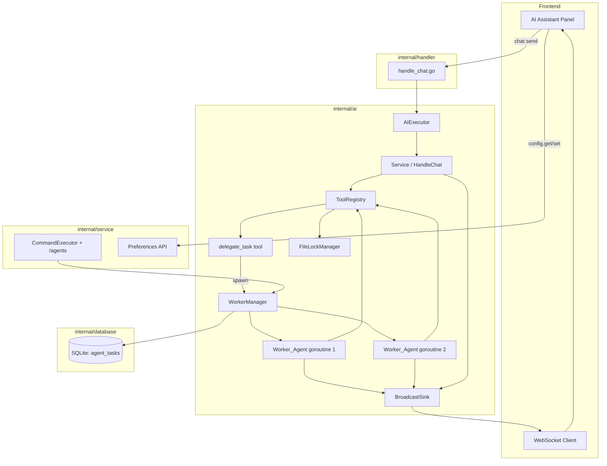
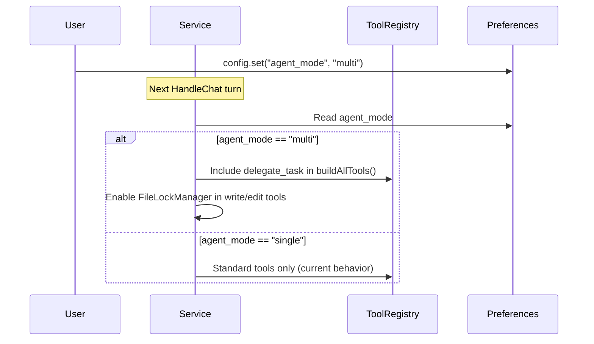
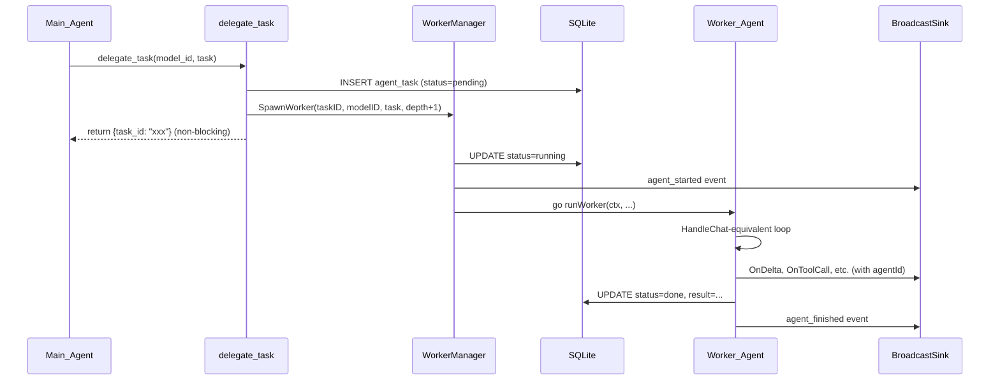

# Design Document: Multi-Agent Delegation

## Overview

This design extends the existing WebOS backend AI system to support multi-agent task delegation. The Main_Agent (the current single `Service.HandleChat` loop) gains the ability to spawn independent Worker_Agents via a `delegate_task` tool. Workers run as goroutines with their own conversation context, share the `ToolRegistry` (with file-lock augmentation), and report progress through the existing `BroadcastSink` event system.

The design is additive: single-agent mode remains the default and is completely unchanged. Multi-agent mode is opt-in via a preference toggle. The three key extension points are:

1. **ToolRegistry** — gains a `delegate_task` tool (conditionally registered based on mode + depth)
2. **Service** — gains a `WorkerManager` that spawns/tracks worker goroutines
3. **BroadcastSink events** — gain an `agentId` field so the frontend can distinguish event sources

All new components live in the `internal/ai` package alongside existing code, with a new `agent_tasks` SQLite table for persistence and a new `/agents` slash command registered in `internal/service/commands.go`.

## Architecture

### High-Level Component Diagram



### Mode Switch Flow



### Task Delegation Flow



## Components and Interfaces

### 1. WorkerManager (`internal/ai/worker_manager.go`)

Central coordinator for worker lifecycle. Owned by `Service`.

```go
type WorkerManager struct {
    mu          sync.Mutex
    workers     map[string]*WorkerHandle  // taskID -> handle
    fileLocks   *FileLockManager
    broadcastFn func(msgType string, data interface{})  // delegates to BroadcastSink.OnSystemEvent
}

type WorkerHandle struct {
    TaskID   string
    AgentID  string            // "worker-{taskID}"
    Cancel   context.CancelFunc
    ConvID   string            // parent conversation ID
    Done     chan struct{}
}

// SpawnWorker creates an agent_task record, launches a goroutine, returns task_id.
func (wm *WorkerManager) SpawnWorker(ctx context.Context, parentConvID, parentAgentID, modelID, taskMsg string, currentDepth, maxDepth int, svc *Service) (string, error)

// GetTask returns the current state of a task from the in-memory registry + DB.
func (wm *WorkerManager) GetTask(taskID string) (*AgentTask, error)

// ListTasks returns all tasks for a conversation.
func (wm *WorkerManager) ListTasks(convID string) ([]AgentTask, error)

// CancelAll cancels all active workers for a conversation.
func (wm *WorkerManager) CancelAll(convID string)
```

### 2. FileLockManager (`internal/ai/file_locks.go`)

Per-path exclusive write locks. Only active when `agent_mode == "multi"`.

```go
type FileLockManager struct {
    mu    sync.Mutex
    locks map[string]chan struct{}  // path -> lock channel (buffered size 1)
}

// Acquire blocks until the lock is available or ctx expires (30s timeout).
func (flm *FileLockManager) Acquire(ctx context.Context, path string) error

// Release releases the lock on the given path.
func (flm *FileLockManager) Release(path string)
```

The lock uses a `chan struct{}` with buffer size 1 as a semaphore. `Acquire` sends to the channel (blocks if full), `Release` receives from it. A 30-second `context.WithTimeout` wraps the acquire attempt.

### 3. delegate_task Tool (`internal/ai/tool_delegate.go`)

Registered conditionally in `buildAllTools()` when `agent_mode == "multi"` and `currentDepth < maxDepth`.

```go
// Tool parameters
type DelegateTaskParams struct {
    ModelID string `json:"model_id"`  // required: which Agent_Model to use
    Task    string `json:"task"`      // required: task description for the worker
}

// Tool returns immediately with:
// {"task_id": "abc123", "status": "pending", "message": "Task delegated to worker"}
```

The tool executor:
1. Validates `model_id` against configured `agent_models` in preferences
2. Calls `WorkerManager.SpawnWorker()`
3. Returns the task_id JSON immediately (non-blocking)

### 4. /agents Slash Command (`internal/service/commands.go`)

Added to the existing command registry. Queries `WorkerManager` via a callback interface.

```go
// Usage:
//   /agents          — list all tasks for current conversation
//   /agents <taskID> — show detailed status of a specific task

// Output format:
// Task abc123 | model: gpt-4o | status: running | started: 2m ago
// Task def456 | model: claude-3 | status: done | result: "Created 3 files..."
```

### 5. AgentSink Wrapper (`internal/ai/agent_sink.go`)

Wraps the parent `BroadcastSink` to inject `agentId` into events. Each Worker_Agent gets its own `AgentSink`.

```go
type AgentSink struct {
    agentID  string
    delegate ChatSink  // the parent BroadcastSink
}

// All ChatSink methods delegate to the parent but the WebSocket serialization
// layer includes agentId in the JSON payload.
// For OnSystemEvent, wraps data with agentId.
```

Implementation approach: Rather than modifying every `ChatSink` method signature, the `AgentSink` wraps events by calling `OnSystemEvent` with an envelope that includes `agentId` + the original event type + data. The frontend parses the envelope. This avoids changing the `ChatSink` interface.

Alternative considered: Adding `agentId` to every ChatSink method. Rejected because it would break the existing interface and require changes to all implementations.

Chosen approach: `AgentSink` implements `ChatSink`. For worker events, it calls the delegate's methods but prefixes the conversationID with agent context. The handler layer (`wsSink`) is updated to include an `agentId` field in the JSON it writes to WebSocket when the field is present in the event data. Worker events use a wrapper `OnSystemEvent` call with type `"agent_event"` containing `{agentId, eventType, data}`.

### 6. Worker Execution Loop (`internal/ai/worker_run.go`)

A simplified version of `HandleChat` for workers:

```go
func runWorker(ctx context.Context, cfg AIConfig, taskMsg string, tools *ToolRegistry, sink ChatSink, systemPrompt string, maxRounds int) (string, error)
```

Key differences from `HandleChat`:
- No conversation persistence (messages stay in-memory only)
- No context compression (workers have short-lived, focused contexts)
- No skill activation (workers use the tool set given at spawn time)
- Uses the provided `AIConfig` resolved from the `model_id`
- Returns the final assistant response as the result string

### 7. Modified buildAllTools() in Service.HandleChat

```go
buildAllTools := func() []ToolDef {
    tools := append([]ToolDef{}, s.tools.Defs()...)
    // ... existing skill tools ...

    // Multi-agent: inject delegate_task if enabled
    if agentMode == "multi" && currentDepth < maxDepth {
        tools = append(tools, delegateTaskToolDef)
    }
    return tools
}
```

### 8. Modified write_file / edit_file Executors

In multi-agent mode, the existing `registerWriteFile()` and `registerEditFile()` executors are wrapped to acquire/release file locks:

```go
// Inside the executor function:
if flm := getFileLockManager(); flm != nil {
    if err := flm.Acquire(ctx, resolvedPath); err != nil {
        return "", fmt.Errorf("file locked by another agent: %v", err)
    }
    defer flm.Release(resolvedPath)
}
// ... existing write/edit logic ...
```

The `FileLockManager` is nil in single-agent mode, so the lock check is a no-op.

## Data Models

### AgentTask (SQLite table: `agent_tasks`)

```sql
CREATE TABLE IF NOT EXISTS agent_tasks (
    task_id                TEXT PRIMARY KEY,
    parent_conversation_id TEXT NOT NULL,
    parent_agent_id        TEXT NOT NULL,
    model_id               TEXT NOT NULL,
    task_message           TEXT NOT NULL,
    status                 TEXT NOT NULL DEFAULT 'pending',
    result                 TEXT NOT NULL DEFAULT '',
    created_at             INTEGER NOT NULL,
    updated_at             INTEGER NOT NULL
);
CREATE INDEX idx_agent_tasks_conv ON agent_tasks(parent_conversation_id);
```

Status transitions: `pending → running → done | failed`

### AgentModel (Preferences JSON under key `"agent_models"`)

```json
[
  {
    "id": "gpt4o",
    "providerId": "openai-main",
    "modelName": "gpt-4o",
    "description": "Fast general-purpose model for code and text tasks",
    "weight": 10,
    "maxTokens": 4096
  },
  {
    "id": "claude3",
    "providerId": "anthropic-main",
    "modelName": "claude-3-5-sonnet-20241022",
    "description": "Strong reasoning model for complex analysis",
    "weight": 5,
    "maxTokens": 8192
  }
]
```

### AgentMode Preference

- Key: `"agent_mode"`
- Values: `"single"` (default) | `"multi"`

### MaxDepth Preference

- Key: `"agent_max_depth"`
- Values: integer, default `1`

### Go Structs

```go
// AgentTask represents a delegated task record.
type AgentTask struct {
    TaskID               string `json:"task_id"`
    ParentConversationID string `json:"parent_conversation_id"`
    ParentAgentID        string `json:"parent_agent_id"`
    ModelID              string `json:"model_id"`
    TaskMessage          string `json:"task_message"`
    Status               string `json:"status"`   // pending, running, done, failed
    Result               string `json:"result"`
    CreatedAt            int64  `json:"created_at"`
    UpdatedAt            int64  `json:"updated_at"`
}

// AgentModel represents a configured AI model for agent assignment.
type AgentModel struct {
    ID          string `json:"id"`
    ProviderID  string `json:"providerId"`
    ModelName   string `json:"modelName"`
    Description string `json:"description"`
    Weight      int    `json:"weight"`
    MaxTokens   int    `json:"maxTokens"`
}
```

### Database Operations (`internal/database/agent_tasks.go`)

```go
func CreateAgentTask(task *AgentTask) error
func UpdateAgentTaskStatus(taskID, status, result string) error
func GetAgentTask(taskID string) (*AgentTask, error)
func ListAgentTasksByConversation(convID string) ([]AgentTask, error)
func DeleteAgentTasksByConversation(convID string) error
```


## Correctness Properties

*A property is a characteristic or behavior that should hold true across all valid executions of a system — essentially, a formal statement about what the system should do. Properties serve as the bridge between human-readable specifications and machine-verifiable correctness guarantees.*

### Property 1: Agent mode determines delegate_task tool availability

*For any* agent_mode value and tool list produced by `buildAllTools()`, the tool list contains `delegate_task` if and only if `agent_mode == "multi"` and `currentDepth < maxDepth`.

**Validates: Requirements 1.2, 1.3, 8.2, 8.3, 8.4**

### Property 2: AgentModel serialization round-trip

*For any* valid `AgentModel` struct, serializing it to JSON and deserializing back produces an equivalent struct with all fields (id, providerId, modelName, description, weight, maxTokens) preserved.

**Validates: Requirements 2.1, 2.4**

### Property 3: Agent model list includes id and description

*For any* non-empty list of `AgentModel` entries, the formatted model information string provided to the Main_Agent contains every model's `id` and `description`.

**Validates: Requirements 2.2**

### Property 4: Invalid model_id produces error

*For any* string that is not present as an `id` in the configured `agent_models` list, invoking `delegate_task` with that string as `model_id` returns an error indicating the model was not found.

**Validates: Requirements 3.4**

### Property 5: delegate_task creates a pending task

*For any* valid `model_id` and non-empty `task` string, invoking `delegate_task` creates an `AgentTask` record with status `"pending"` and returns a non-empty `task_id`.

**Validates: Requirements 3.2**

### Property 6: Agent task state machine validity

*For any* sequence of status transitions applied to an `AgentTask`, only the transitions `pending → running`, `running → done`, and `running → failed` are accepted. Any other transition is rejected.

**Validates: Requirements 4.5, 5.3, 5.4**

### Property 7: /agents command lists all conversation tasks

*For any* set of `AgentTask` records associated with a conversation, the output of the `/agents` command for that conversation contains every task's `task_id`, `model_id`, and `status`.

**Validates: Requirements 4.1, 4.2**

### Property 8: Worker messages do not leak into main conversation

*For any* worker execution, the number of messages in the parent conversation's `ai_messages` table does not increase as a result of the worker's internal tool calls and assistant responses.

**Validates: Requirements 5.5, 9.4**

### Property 9: File lock mutual exclusion

*For any* file path, if one agent holds the lock, a second concurrent acquire attempt on the same path blocks until the first agent releases or the timeout expires. After release, a subsequent acquire succeeds immediately.

**Validates: Requirements 6.2, 6.5**

### Property 10: Worker agentId uniqueness and format

*For any* set of spawned workers within a conversation, all `agentId` values are unique, the Main_Agent's agentId is `"main"`, and each worker's agentId is derived from its `task_id`.

**Validates: Requirements 7.2, 7.3**

### Property 11: Worker lifecycle events

*For any* worker that is spawned and completes (or fails), the system emits exactly one `agent_started` event (containing agentId, task_id, model_id) and exactly one `agent_finished` event (containing agentId, task_id, status, result summary).

**Validates: Requirements 7.4, 7.5**

### Property 12: Depth propagation invariant

*For any* worker at depth N that spawns a sub-worker, the sub-worker's depth is exactly N + 1.

**Validates: Requirements 8.5**

### Property 13: Worker system prompt contains required elements

*For any* worker configuration (task description, depth level, working directory), the generated worker system prompt contains the task description, the assigned working directory hint, the current depth level, and the SystemContext content from the parent Service.

**Validates: Requirements 9.1, 9.2, 6.6**

### Property 14: Worker initial context is minimal

*For any* spawned worker, the initial message list contains exactly two messages: one system message (the system prompt) and one user message (the task description).

**Validates: Requirements 3.5, 9.3**

### Property 15: AgentTask persistence round-trip

*For any* valid `AgentTask` struct, inserting it into the database and reading it back by `task_id` produces an equivalent struct with all fields preserved.

**Validates: Requirements 10.1, 10.2**

### Property 16: AgentTask query by conversation filters correctly

*For any* set of `AgentTask` records across multiple conversations, querying by `parent_conversation_id` returns exactly the tasks belonging to that conversation and no others.

**Validates: Requirements 10.4**

### Property 17: AgentTask status update advances timestamp

*For any* `AgentTask` status update, the `updated_at` timestamp after the update is strictly greater than or equal to the `updated_at` timestamp before the update.

**Validates: Requirements 10.3**

## Error Handling

### Tool Execution Errors

| Error Condition | Handling |
|---|---|
| Invalid `model_id` in `delegate_task` | Return tool error: `"model not found: {model_id}"`. Main_Agent can retry with a valid ID. |
| Worker goroutine panics | Recover in `runWorker`, set task status to `"failed"`, store panic message as result. |
| Worker context cancelled (parent deleted) | `WorkerManager.CancelAll()` cancels all worker contexts. Workers detect `ctx.Err()` and exit. Task status set to `"failed"` with `"cancelled"` result. |
| File lock timeout (30s) | Return error to the requesting agent: `"file locked by another agent: {path} (timeout)"`. Agent can retry or choose a different file. |
| Worker LLM API error | Same as existing `HandleChat` error handling — `OnError` event emitted, task status set to `"failed"`. |
| Worker exceeds max tool rounds | Task status set to `"failed"` with `"exceeded max tool rounds"` result. |
| No agent_models configured in multi mode | Fall back to active provider/model from `AIMultiConfig`. If that also fails, return tool error. |
| Database write failure for agent_task | Log error, return tool error to the calling agent. Worker is not spawned. |

### Graceful Degradation

- If `WorkerManager` encounters an error spawning a worker, the `delegate_task` tool returns an error message. The Main_Agent can inform the user or retry.
- If the `/agents` command fails to query the database, it returns an error message rather than crashing.
- File lock manager failures (e.g., corrupted state) fall back to no-lock behavior with a warning log, rather than blocking all writes.

### Worker Cleanup

When a parent conversation is deleted via `Service.DeleteConversation()`:
1. `WorkerManager.CancelAll(convID)` cancels all active worker contexts
2. `database.DeleteAgentTasksByConversation(convID)` removes task records
3. Worker goroutines detect cancellation and exit cleanly

## Testing Strategy

### Property-Based Testing

Library: **`pgregory.net/rapid`** (Go property-based testing library)

Each correctness property from the design document is implemented as a single property-based test with minimum 100 iterations. Tests are tagged with comments referencing the design property.

```go
// Feature: multi-agent-delegation, Property 1: Agent mode determines delegate_task tool availability
func TestProperty1_AgentModeDeterminesToolAvailability(t *testing.T) {
    rapid.Check(t, func(t *rapid.T) {
        mode := rapid.SampledFrom([]string{"single", "multi"}).Draw(t, "mode")
        depth := rapid.IntRange(0, 5).Draw(t, "depth")
        maxDepth := rapid.IntRange(1, 5).Draw(t, "maxDepth")
        tools := buildAllToolsForTest(mode, depth, maxDepth)
        hasDelegateTask := containsTool(tools, "delegate_task")
        expected := mode == "multi" && depth < maxDepth
        if hasDelegateTask != expected {
            t.Fatalf("mode=%s depth=%d maxDepth=%d: hasDelegateTask=%v expected=%v", mode, depth, maxDepth, hasDelegateTask, expected)
        }
    })
}
```

Property tests cover: Properties 1–17 as defined in the Correctness Properties section.

### Unit Testing

Unit tests complement property tests by covering specific examples, edge cases, and integration points:

- **Edge cases**: Empty agent_models list fallback (Req 2.3), lock timeout behavior (Req 6.3, 6.4), conversation cancellation propagation (Req 5.6)
- **Integration points**: `/agents` command registration and execution, `delegate_task` tool registration in `ToolRegistry`, `AgentSink` event wrapping
- **Specific examples**: Creating a task with known parameters and verifying exact DB state, spawning a worker with a mock LLM and verifying lifecycle events

### Test Organization

```
webos-backend/internal/ai/
  worker_manager_test.go     — Properties 5, 6, 8, 11, 12, 14 + unit tests
  file_locks_test.go         — Property 9 + timeout edge cases
  tool_delegate_test.go      — Properties 1, 4 + tool schema example
  agent_sink_test.go         — Properties 10, 11 + event format unit tests
  worker_prompt_test.go      — Properties 13, 14

webos-backend/internal/database/
  agent_tasks_test.go        — Properties 15, 16, 17 + edge cases

webos-backend/internal/service/
  commands_agents_test.go    — Property 7 + /agents command unit tests

webos-backend/internal/ai/
  agent_model_test.go        — Properties 2, 3 + fallback edge case
```

### Test Configuration

- Property tests: minimum 100 iterations per property (rapid default)
- Each property test tagged: `// Feature: multi-agent-delegation, Property N: {title}`
- Unit tests use `testing.T` with table-driven subtests where appropriate
- Database tests use an in-memory SQLite instance
- Concurrency tests (Property 9) use `sync.WaitGroup` and goroutines to simulate parallel lock contention
